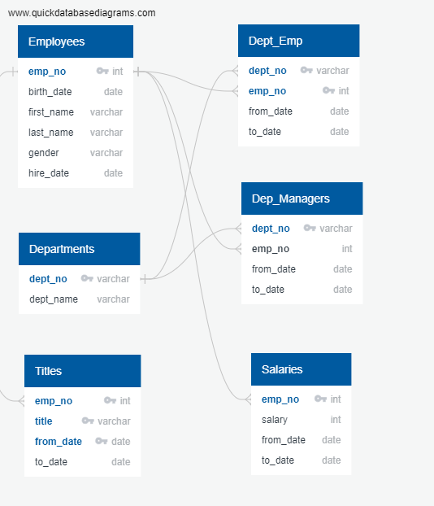

# Pewlett-Hackard-Analysis

## Module 7 Challenge

SQL project (Employee Database)

### **Assiggment**

PH needs to be prepared for the "silver tsunami" approaching soon.  This assignment is to analyse employee data to generate a number of retiring employees by title to understand characteristics of the retirement ready pool of employees, and to identify employees who are elibigle to participate in a mentorship program to future proof PH's workforce.  

### **Analysis**
**1. Number of Retiring Employees by Title**

  PH mantains the following lists of employee data.

  Since not one list of data contains all the infomation we need to provide the anlaysis, the tables need to be "joined" and "grouped by" to produce the relevant imformation.

  First, the Employees table is filtered by the birth date between 1952-1-1 and 1955-12-31 to proivde the list of retirement eligible emploeeys (Retirement_Info).

  Secondly, the Retirement Info table is joined by the Emp Dept table and then filtered by to_date 9999-01-01 to provide Current Emplyees table (Current_Emp).

  Thirdly, the Current Emplyees table is joined by the Title and the Salary tables to provide the title and salary info as follows.

-- Deliverable 1 Step 1

SELECT ce.emp_no 
, ce.first_name 
, ce.last_name 
, t.title 
, t.from_date 
, s.salary 
INTO retiring_emp 
FROM current_emp AS ce 
INNER JOIN titles AS t 
ON (ce.emp_no = t.emp_no) 
INNER JOIN salaries AS s 
on (ce.emp_no = s.emp_no);

  Here the number of employees with each title (historical) is quaried by:

-- Deliverable 1 Step 2: Number of employees with each title (historical, including duplicates) 

SELECT count(emp_no), title 
INTO number_of_emp_by_title 
FROM retiring_emp 
GROUP BY title 
ORDER BY title; 

  However, the Retiring Emp talbe now has duplicate entries for the employees who have changed titles over their tenure PH.  Using partitioning, the Retiring Emp1 is now only showing the last titles for each retirement approaching employees.

-- Deliverable 1 Step 3: Partition the data to show only most recent title per employee 

SELECT emp_no 
,first_name 
,last_name 
,title 
,from_date 
,salary 
INTO retiring_emp1 
FROM 
 (SELECT emp_no 
,first_name 
,last_name 
,title 
,from_date 
,salary, ROW_NUMBER() OVER 
 (PARTITION BY (emp_no) 
 ORDER BY from_date DESC) rn 
 FROM retiring_emp 
 ) tmp WHERE rn = 1 
ORDER BY emp_no; 

-- Number of retiring employees with each title (no duplicates) 

SELECT count(emp_no), title 
INTO number_of_retiring_by_title 
FROM retiring_emp1 
GROUP BY title 
ORDER BY count(emp_no) DESC; 

**2. Mentorship Eligibility**

  One of the measures that PH will take to mitigate the "silver tsunami" is to provide a mentorship program and the employees with a birth date between January 1, 1965 and December 31, 1965 will be eligible to participate.  The following quary was used to create this new table.

-- Deliverable 2: Mentorship Eligibility 

SELECT e.emp_no, e.first_name, e.last_name, t.title, t.from_date, t.to_date 
INTO mentorship 
FROM employees AS e 
INNER JOIN titles AS t 
ON (e.emp_no = t.emp_no) 
WHERE (birth_date BETWEEN '1965-01-01' AND '1965-12-31') AND to_date = '9999-01-01'; 

### **Conclusion**
  As you can see from the number_of_retiring_by_title table, 33,118 employees are retirement-eligible and the two biggest titles are Senior Engineers and Senior Staff, making up 80% (26,523) of total retirement-eligible employees.  The mentorship program will have a total 1,549 employees eligible to participate.  This data doesn't provide much detail as to which department would suffer most when the "silver tsunami" hits the shore and the pool of mentorship eligible employees are proprotionally represented for the program to be effective. As a follow up analysis, it would be helpful to see the number of the retirement eligible employees and the mentorship eligible employees by departments.

---

### **Deliverable 1: Number of Retiring Employees by Title**

* Table 1 Number of Retiring Employees By Title (Retiring Title) <- only most recent : number_of_retiring_by_title.csv
* Table 2 Number of Employees with Each Title (Employees By Title) <- historical: number_of_emp_by_title.csv
* Table 3 List of Current Employees Born Between 1952-1-1 and 1955-12-31: retiring_emp1.csv

### **Deliverable 2: Mentorship Eligibility**

* A list of current employees born between Jan. 1, 1965 and Dec. 31, 1965: mentorship.csv

